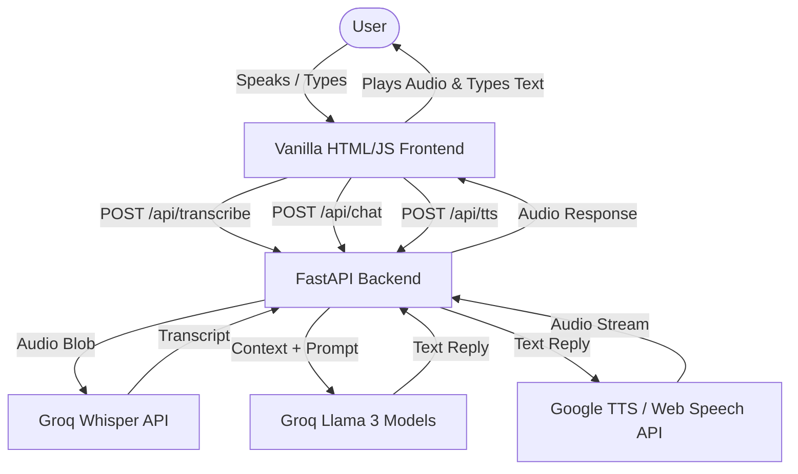

# 🎙️ Arslan.AI — Real-Time Voice Agent


A lightning-fast, dark-mode real-time voice chat agent built using FastAPI, Groq's ultra-low latency Llama 3 models, Whisper transcriptions, and Google Text-to-Speech (gTTS) for sub-second, highly-responsive conversational AI.

## 🌐 Live Demo & Media

- **Live App:** [https://arslan-ai-voice-agent.vercel.app/](https://arslan-ai-voice-agent.vercel.app/)
- **Demo Video:** *Placeholder for Demo Video*

## 📸 Screenshots


## ✨ Key Features

- **⚡ Lightning Fast Responses:** Powered by Groq's Llama 3 models for near-instant AI responses.
- **🎤 Real-Time Live Call Mode:** Hands-free, continuous conversation that intelligently detects when you stop speaking.
- **🎧 High-Quality Voice Synthesis:** Utilizes `gTTS` and Web Speech API fallbacks to ensure natural spoken responses locally and in cloud environments.
- **⌨️ Seamless Typing Sync:** The AI's responses are dynamically typed out on the screen perfectly synced with its spoken voice.
- **📱 Fully Responsive Design:** Sleek, modern dark-mode neon-green interface that works seamlessly on desktop and mobile.

## 🛠️ Tech Stack Table

| Component | Technology | Purpose |
| --- | --- | --- |
| **Backend** | FastAPI (Python) | High-performance API server and serverless functions |
| **LLM Inference** | Groq API | Lightning-fast text generation using Llama 3 |
| **Transcription (STT)** | Groq Whisper | Converting user voice messages to text |
| **Speech Synthesis (TTS)** | gTTS / Web Speech API | Generating AI spoken audio responses reliably in cloud deployments |
| **Frontend** | HTML/CSS/JS (Vanilla) | Custom responsive UI with Web Audio API for silence detection |

## ⚙️ How It Works

1. **Audio Capture:** The browser records user audio (via single message or live call) and sends the blob to the backend.
2. **Transcription:** The FastAPI backend pipes the audio to Groq's Whisper API to transcribe speech into text.
3. **LLM Generation:** The transcript, along with conversation history, is sent to Groq's Llama 3 models to instantly generate a contextual reply.
4. **Speech Synthesis:** The text reply is converted to an audio stream via `gTTS` (with browser Web Speech API fallback).
5. **Playback & Typing:** The frontend receives the audio, begins playback immediately, and dynamically animates the text onto the screen in sync with the audio.

## 🏗️ Project Architecture



## 📂 Project Structure

```
├── .gitignore
├── README.md
├── main.py
├── requirements.txt
├── vercel.json
└── static/
    ├── app.js
    ├── index.html
    └── style.css
```

## 💻 Local Setup & Installation

### Prerequisites
- Python 3.9+
- A [Groq API Key](https://console.groq.com/keys)

### Installation Steps

1. **Clone the repository**
   ```bash
   git clone https://github.com/Arslan-Codes097/Arslan.AI-Voice-Agent-.git
   cd Arslan.AI-Voice-Agent-
   ```

2. **Set up virtual environment**
   ```bash
   python -m venv venv
   source venv/bin/activate  # On Windows: venv\Scripts\activate
   ```

3. **Install dependencies**
   ```bash
   pip install -r requirements.txt
   ```

4. **Configure environment variables**
   Create a `.env` file and add your Groq API key:
   ```bash
   GROQ_API_KEY=your_key_here
   ```

5. **Run the server**
   ```bash
   uvicorn main:app --reload
   ```
   Open `http://localhost:8000` in your browser.

## 🚀 Deployment (Vercel)

This project is configured for 1-click deployment on [Vercel](https://vercel.com).
1. Push this repository to GitHub.
2. Sign in to Vercel and click **Add New...** -> **Project**.
3. Import your GitHub repository (`Arslan.AI-Voice-Agent-`).
4. Leave the Framework Preset as **Other**.
5. Add the `GROQ_API_KEY` to the Environment Variables section.
6. Click **Deploy**!

## 👤 Author & Credits

**Arslan**
- GitHub: [@Arslan-Codes097](https://github.com/Arslan-Codes097)
- LinkedIn: [Arslan Babar](https://www.linkedin.com/in/arslan-babar-27516731a/)
- Phone: +92 326 744 1052
